### 一. 项目描述
LBS（Location Based Service，基于位置的服务）让我们的生活变得更加便捷。随着GPS芯片等位置传感器成本的日益降低，位置追踪、地理围栏（GEO-fencing）这一类LBS正在兴起，对于保障人员、重要物资的安全起到重要作用。NMEA-0813是由美国国家海洋电子协会开发的，目前GPS接收机上使用最广泛的标准协议，它定义了多种语句，包含了关于定位结果、信号状态、工作模式等丰富的信息。本项目通过对NMEA格式的数据进行解析，获得目标的位置、速度、工作卫星信号状态数据，并通过界面显示。此外，可结合地图显示目标的地理位置，允许用户通过图形界面交互设置边界，并实现越界告警功能。在本软件课设中，不用实时获取GPS数据，只需从NMEA格式的GPS数据文件中读取相应信息，离线演示相关功能。
### 二. 任务需求
1.	软件必须做界面，且对用户友好，易于操作；
2.	能正确读取符合NMEA-0813协议的GPS数据，并正确显示；
3.	能显示地图，并地图上显示定位结果并标记轨迹；
4.	能自定义设定监控目标允许活动的位置区域，当目标离开限定区域时，能发出越界报警并记录
### 三. 需求分析
1. 软件必须做界面，因为课设的时间比较紧张，为了快速上手，我们需要一种比较高效的UI设计的开发环境，几经挑选，我们选择了`Qt(C++图形用户界面应用程序开发框架)`,Qt集成了Qt Creator。Qt Creator是一个用于Qt开发的轻量级跨平台集成开发环境。Qt Creator可带来两大关键益处：提供首个专为支持跨平台开发而设计的集成开发环境 (IDE)，并确保首次接触Qt框架的开发人员能迅速上手和操作。即使不开发Qt应用程序，Qt Creator也是一个简单易用且功能强大的IDE。
2. 因为已经确定了`C++`作为我们的编程语言，故可利用一些文件及字符串的库进行NMEA-0813协议的GPS数据解析。
3. 百度地图、高德地图、Google地图均提供了在线的API,申请成为开发者之后即可使用相应的服务。三者相比较而言，我们选择了百度地图，因为在中国大陆它提供的定位更加精确，并且它的API函数十分清晰。因此，这就要求我们需要实现网络通信功能，而Qt也提供QWebviw模块，因此我们可设计一个Browser来完成必要的网络通信。
4. 要实现自定义设定监控目标允许活动的位置区域，当目标离开限定区域时，能发出越界报警这个功能，需要我们具备绘制图形（即地理围栏）和判断点是否在所绘图形之内这两个基本功能。
* 绘制图形可以用Qt实现，或者用百度地图API。
* 判断点是否在给定区域内需要比较好的算法，可以搜集资料再修改测试得到，也可利用已有的百度地图API。
5. 代码需要有一定的健壮性和鲁棒性，比如需要对NMEA文档进行校验，对用户误操作进行修正和提示，能够初始化，能够清除数据等。
### 四. 总体设计
1.  软件界面设计
* 主界面设计

* 对话框设计

* 弹出框(提示|警告)设计

2.  NMEA-0813协议的GPS数据解析
* 校验。采用差分方式检验数据，与已有的校验值比对，以排除错误数据。
* 坐标转换。将解析得到的`地球`坐标转换成可用的`BD-09`坐标，才能减小因参考坐标系的不同造成的定位误差。
* 其它信息的获取。因为该协议规定用7条语句来描述一个点的信息，因此能够解析出比较详细的信息,我们主要解析经纬度、速度、时间、日期、方向角、磁偏角、校验值这几项主要的信息
* 将已获取的数据存储在结构体中，并利用设计的记录框将其显示出来。
3. 定位及标记轨迹
* 将已经获取的经纬度传递至`JavaScript`,然后利用API将其定位。
* 两个定位点之间连线，只要点数足够，便能绘制出比较接近真实的轨迹。
4. 地理围栏的绘制及判断
* 可直接调用百度地图提供的鼠标绘制工具，然后将绘制的图形存储下来。
* 将已经得到的点与地理围栏进行判断，判断方法也是利用API函数，并且显示与每个围栏之间的关系。
5. 动态功能
* 集成所能实现的功能，分为动态演示和动态轨迹
* 动态演示所能实现的功能为：可直接利用鼠标点击在地图上加上定位点，然后进行动态的判断点与围栏的关系。判断方法为：当点连续在围栏外出现时，不警告；当点第一次进入围栏时，发出警告，并记录进入时的经纬度；当点在第一次出现在围栏内之后连续在围栏内出现，不发出警告；一旦有点出现在围栏外，则报警，警告离开地理围栏。
* 动态轨迹所能实现的功能为：利用已经解析好的一系列的点，隔3秒绘制一条连续的线段，并且绘制时同时进行判断与围栏之间的关系，判断方法与动态演示一致。
### 五. 详细设计
#### (一) 软件整体框图及流程图
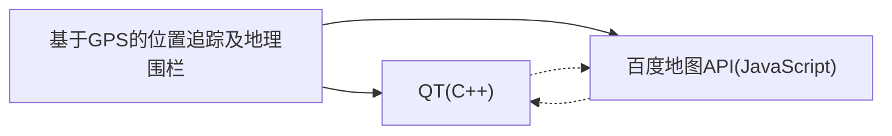
程序总的流程图：
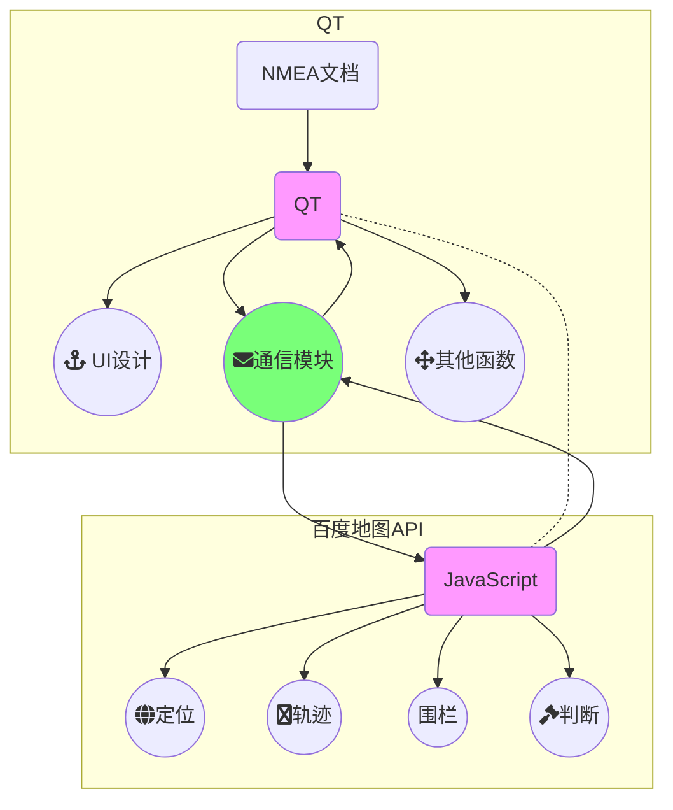
#### (二) Qt端设计
##### 1. UI
1. 设计思想
利用Qt Creator可视化设计
2. 主界面

3. 记录界面

##### 2. NMEA-0813协议的GPS数据解析
1. 设计思想
* 校验。采用差分方式检验数据，与已有的校验值比对，以排除错误数据。
* 坐标转换。将解析得到的`地球`坐标转换成可用的`BD-09`坐标，才能减小因参考坐标系的不同造成的定位误差。
* 其它信息的获取。因为该协议规定用7条语句来描述一个点的信息，因此能够解析出比较详细的信息,我们主要解析经纬度、速度、时间、日期、方向角、磁偏角、校验值这几项主要的信息
* 将已获取的数据存储在结构体中，并利用设计的记录框将其显示出来。
2. 流程图
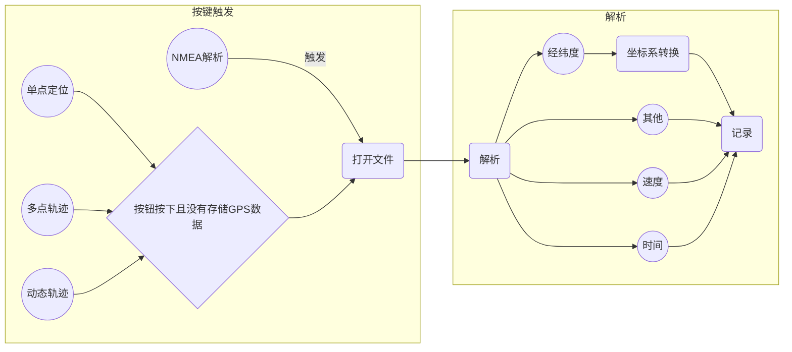
3. 主要代码
```c++
//定义结构体储存解析数据
typedef struct {
    double  rcv_time;           //时间
    char    status;             //状态
    double  lat;                //纬度
    char    lat_direct;         //北纬 or 南纬
    double  lon;                //经度
    char    lon_direct;         //东经 or 西经
    double  speed;              //速度
    double  cog;                //方位角
    int     date;               //日期
    double  mag_variation;      //磁偏角
    char    mag_var_direct;     //磁偏角方向
    char    mode;               //校验类型
    int     chksum;             //校验和
} gprmc_format;
```
4. 效果图

##### 3. 对话框
1. 设计思想
记录解析NMEA文档得到的数据，记录进出围栏的数据
2. 流程图
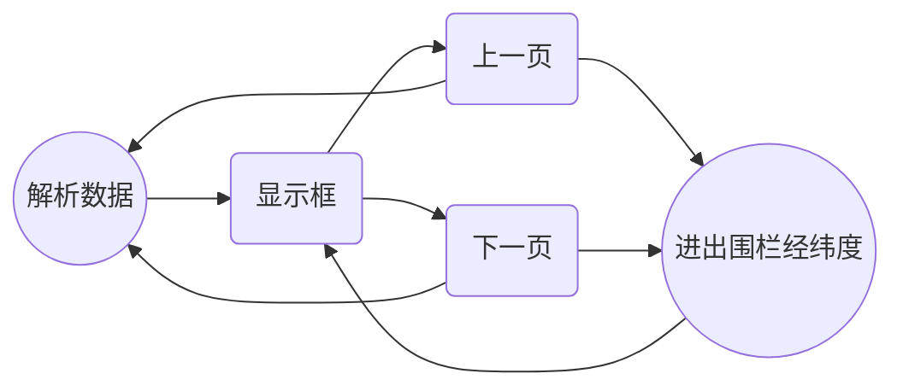
3. 伪代码
```c++
if(上一页 || 下一页)
{
  显示点 = 解析数据结构体数组 - 1 || +1;
  //一面显示6个经纬度
  显示经纬度 = 记录数据结构体数组 -6 || +6
}
show();
```
4. 效果图


#### (三) QT与JavaScript的通信机制
1. 因为我们使用了两种不同的编程语言，故需要一种机制在协调两者之间的关系，以达到可以彼此调用的效果。这种效果可以表现为互相调用对方的函数，并且完成参数传递过程。
2. `JavaScript`调用`QT`中的函数：
```c++
        //将Qt与JavaScript联系起来
connect(ui->webView->page()->mainFrame(), SIGNAL(javaScriptWindowObjectCleared()),
        this, SLOT(slotPopulateJavaScriptWindowObject()));  
```
* 第一个参数`ui->webView->page()->mainFrame()`是信号的发送方，它发出`javaScriptWindowObjectCleared()`信号
* 第二个这个信号的具体形式就像`pushbutton`的`click()`信号，都是已经写好的。
* 第三个参数是`this`,一个指针。
* 第四个参数是`slotPopulateJavaScriptWindowObject()`函数。这条语句的意思就是：在收到`mainFrame()`发出的`SIGNAL`后，`this`调用`slotPopulateJavaScriptWindowObject`实现相应的操作或者功能，而这个功能就是 将`QObject`对象传给`JavaScript`，这样`JavaScript`就能调用`QObject`的`public slots`函数,就如同使用自己的`function`一样。
3. `QT`调用`JavaScript`中的函数：
```c++
QWebFrame *webFrame = ui->webView->page()->mainFrame();
QString cmd = QString("showAddress(\"%1\",\"%2\")").arg(lon).arg(lat);
webFrame->evaluateJavaScript(cmd);

//意思就是，一个`QwebFrame`指针可以通过`evaluateJavaScript`函数把命令传递过去，
//在以上的代码中这个命令就是`showAddress()`，这个就是js中的一个函数。
//仿佛是在直接调用qt中的函数。同时传递参数
```
4. 流程图
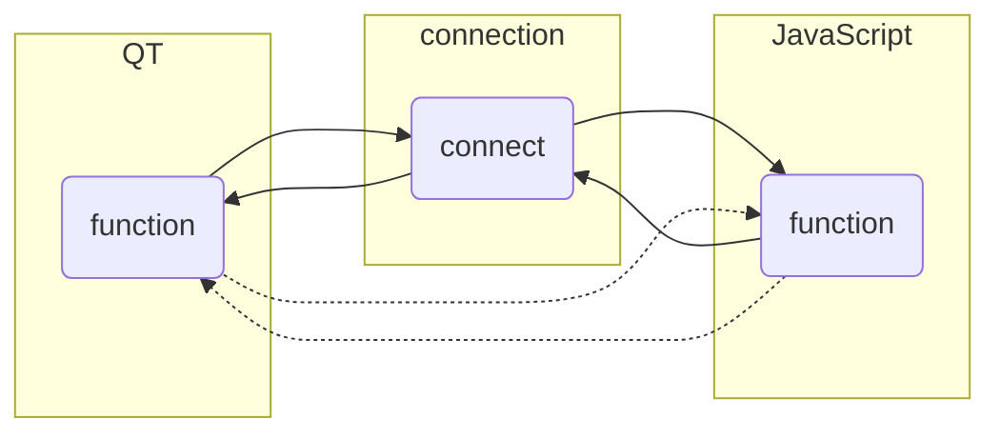
#### (四) JavaScript端设计
##### 1. 单点定位
1. 设计思想
我们将已解析好的数据存入结构体，在需要的时候（单点定位按钮触发）调用Javascript的我们自己写的showlocation()函数，完成数据格式转换后将数据传至百度地图API,再通过浏览器显示出来。
2. 流程图
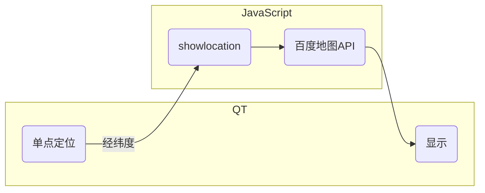
3. 主要代码
```javascript
function showlocation(longjitude, latitude)		//根据(longjitude,latitude)定位并添加标记
{

   var gpsPoint = new BMap.Point(longjitude, latitude);

   pointlist.push(gpsPoint);				//将新的定位点压入数组
   map.panTo(gpsPoint);
   var marker = new BMap.Marker(gpsPoint); // 创建点
   map.addOverlay(marker);                 // 加载标注
   marker.setPosition(gpsPoint);
   marker.setAnimation(BMAP_ANIMATION_BOUNCE); //跳动的动画
   //marker.setAnimation(BMAP_ANIMATION_DROP); //坠落的动画
   map.centerAndZoom(gpsPoint,18);
}

```
4. 效果图

##### 2. 多点轨迹
1. 设计思想
与单点定位有所不同的是，轨迹需要一系列的点，因此将一个数组的经纬度传给百度地图API,然后交由浏览器显示。
2. 流程图
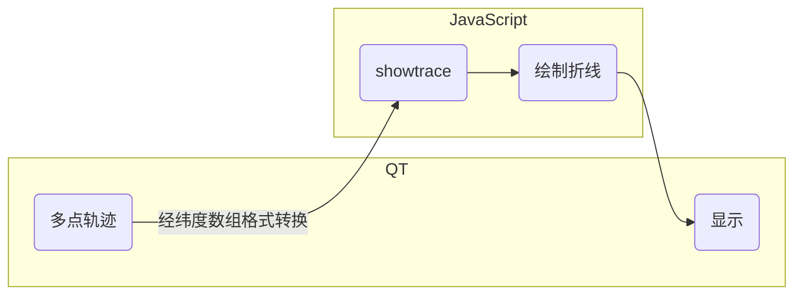
3. 主要代码(截取部分)
```javascript
function QstringToBaiduPoint(longjitude,latitude)		
//仅把qt传来的数组转换成可用的point.并存入tracelist当中
{
	var lonlist,latlist,point;							
  //以下为格式转换，分割成可用的数组
	lonlist = longjitude.substring(1,longjitude.length-1);
	latlist = latitude.substring(1,latitude.length-1);
	lonlist = lonlist.split(",");
	latlist = latlist.split(",");

}
function showtrace(longjitude,latitude)	//显示运动轨迹
{
	tracelist = []; //初始化

	if(QstringToBaiduPoint(longjitude,latitude)!=1)		//如果为多个点，则绘制折线
	{
		var sy = new BMap.Symbol(BMap_Symbol_SHAPE_BACKWARD_OPEN_ARROW, {
		scale: 0.6,//图标缩放大小
		strokeColor:'#fff',//设置矢量图标的线填充颜色
		strokeWeight: '2',//设置线宽
		});

		var icons = new BMap.IconSequence(sy, '10', '30');
		// 创建polyline对象
		var polyline =new BMap.Polyline(tracelist, {
		enableEditing: false,//是否启用线编辑，默认为false
		enableClicking: true,//是否响应点击事件，默认为true
		icons:[icons],
		strokeWeight:'8',//折线的宽度，以像素为单位
		strokeOpacity: 0.8,//折线的透明度，取值范围0 - 1
		strokeColor:"#18a45b" //折线颜色
		});
		map.addOverlay(polyline);          //增加折线
	}
}
```
4. 效果图

##### 3. 绘制地理围栏
1. 设计思想
可直接调用百度地图提供的鼠标绘制工具，然后将绘制的图形存储下来。
2. 流程图
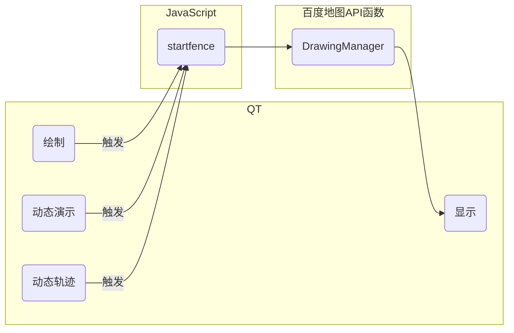
3. 主要函数(部分代码)
```javascript
if 显示动作触发：
    Qt调用Javas端的startfence();
    //javascript实例化鼠标绘制工具
    var drawingManager = new BMapLib.DrawingManager
    //添加鼠标绘制工具监听事件，用于获取绘制结果
    drawingManager.addEventListener('overlaycomplete', overlaycomplete);
    //圆或者多边形的覆盖物,存入一个list
    if((e.overlay.toString() == '[object Circle]')||(e.overlay.toString() == '[object Polygon]')){
			overlays.push(e.overlay);
		}
    //鼠标标记点,存入另一个list
    if(e.overlay.toString() == '[object Marker]'){		
			pointlist.push(e.overlay.getPosition());
      //添加坠落动画
			e.overlay.setAnimation(BMAP_ANIMATION_DROP);
    }
```
4. 效果图

##### 4. 判断关系
1. 设计思想
能否准确的判断点与围栏的关系，是成败的关键。通过阅读类参考手册，我发现了`GeoUtils`这个库提供了判断功能，能够返回需计算点与需判断覆盖物(围栏)的关系,因此我们只需要调用此库的函数加以判断，再根据判断结果做相应动作即可。
2. 流程图
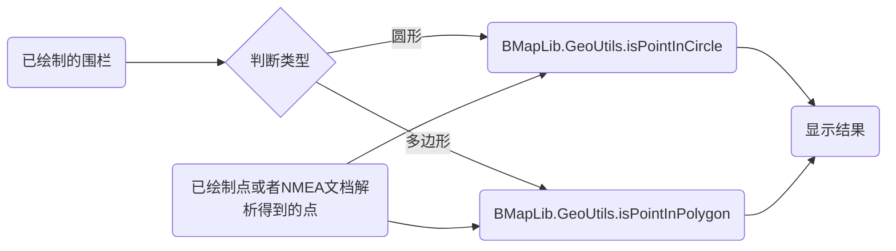
3. 主要函数(伪代码)
```javaScript
//属于圆形，判断
if(overlays[i].toString() == '[object Circle]')
		{ //调用QT的弹出框显示关系
      if( BMapLib.GeoUtils.isPointInCircle(point,overlays[i])){
				ReinforcePC.showinfo(1,"ID "+i);		//目的是能正确显示中文
			}
			else{
				ReinforcePC.showinfo(3,"ID "+i);
			}
		}
//属于多边形，判断
if(overlays[i].toString() == '[object Polygon]')
		{ //调用QT的弹出框显示关系
      if( BMapLib.GeoUtils.isPointInPolygon(point,overlays[i])){
      				ReinforcePC.showinfo(2,"ID "+i);
      			}
      else{
      				ReinforcePC.showinfo(4,"ID "+i);
      			}
		}
```
4. 效果图


#### (五) 动态设计
1. 设计思想
为了集成所有设计的模块，展现所有功能，更好的掌握软件设计的精髓，我设计了两个动态功能。一是动态演示，通过鼠标点击模仿定位，直接显示点与各围栏之间的关系。二是模仿物体运动，动态的显示轨迹，并支持动态地添加围栏和判断关系。判断方法是：当点连续在围栏外出现时，不警告；当点第一次进入围栏时，发出警告，并记录进入时的经纬度；当点在第一次出现在围栏内之后连续在围栏内出现，不发出警告；一旦有点出现在围栏外，则报警，警告离开地理围栏。
2. 流程图
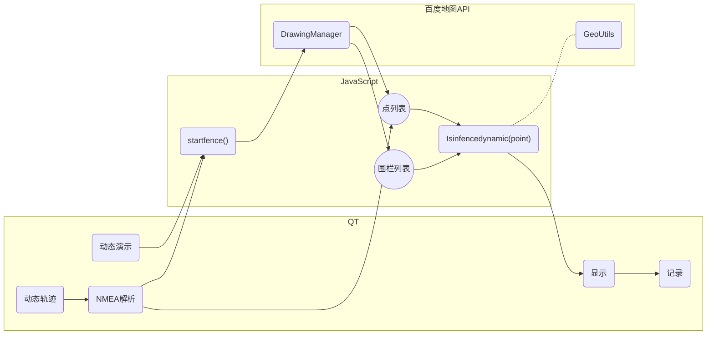
3. 主要函数(伪代码)
```javaScript
if 动态演示触发：
    startfence();
    Isinfencedynamic(point)
    showinfo()
    记录
if 动态轨迹触发：
    startfence();
    定时器开启,每三秒绘制一段轨迹，绘制完毕关闭定时器
    Isinfencedynamic(point)
    showinfo()   
    记录
```
4. 动态演示效果图


5. 动态轨迹效果图


### 六. 分工及贡献
1. 彭智亮 (Nmea解析 定位 轨迹 围栏 动态 约50%)
2. 袁鹏轩 (Nmea解析 UI设计 约30%)
3. 孙诗凇 (UI设计 数据搜集 约20%)
### 七. 测试流程
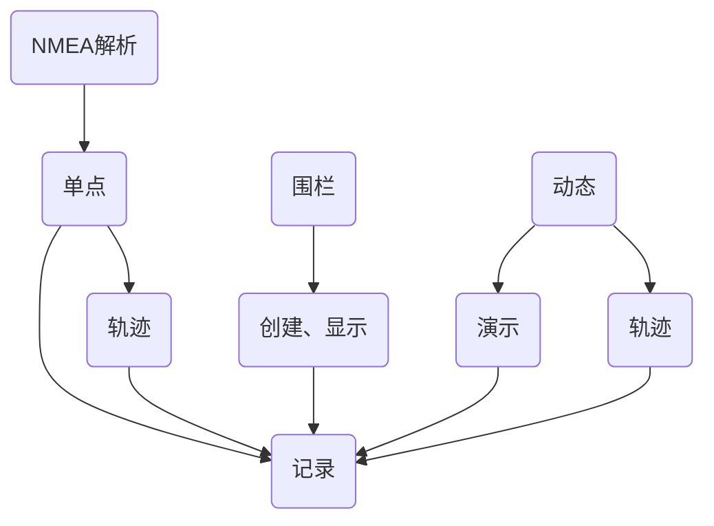
### 八. 所遇问题及解决
遇到问题是必然的，作为这一个小团队的负责人，我必须更加沉着地应对，才能保证课程设计顺利地完成。
1. 界面自适应的问题。一开始没有考虑到布局问题，只是添加部件，因此放大主界面到全屏时，主界面只是填充空白，后来经过小组成员袁鹏轩在网上搜索，在一篇博客里找到了这个问题的描述。
2. Qt的主界面和记录框的数据传递问题。因为主界面和记录框界面的函数实现是在不同的文件里面，如果简单的包含的话，会遇上Qt报一些莫名其妙的错误，所以涉及到传递数据问题，如果只是简单的整体传递数据的话，我认为有两个缺陷，一是浪费内存，资源利用率不高；二是不能同步数据，主界面的数据发生变化时，数据不能及时的同步。这个问题困扰了我一阵子，就暂时不考虑，偶然间翻C++的参考书，看到了指针才恍然大悟，因此采用传递结构体数组指针解决了此问题。
3. Qt和JavaScript的通信机制问题。可以说这个问题是解决课设的关键了，我花了很大力气去翻阅资料，查找博客，才明白了其中的细节，并且整理了一下自己的收获，将起放到了自己的博客上,博客[地址](https://pengzhiliang.github.io/2017/12/23/Qt%E4%B8%8EJavascript%E7%9A%84%E9%80%9A%E4%BF%A1%E6%9C%BA%E5%88%B6/):https://pengzhiliang.github.io,也帮助了班上的几个同学理解此问题
4. 判断算法。起初我是想通过Qt来判断点与围栏的关系，但是除了圆的判断比较准确，多边形的判断并不准确，而且算法并不容易理解，最重要的问题是多边形的数据从Javascript传至Qt是难以实现的，圆、矩形还可以实现，但是不规则的多边形实现不了，数据传输和构建十分复杂，因此就产生了放弃此方法的想法。于是打算另辟蹊径，在百度地图开发者网站上翻阅，从鹰眼服务的地理围栏入手，找到了其实现判断的方法，原来是通过调用自己已实现的库，于是这个问题也就迎刃而解了。
5. 因为我的编程基础还不错，小的问题都可以通过网络和自己的实践解决，同时也注意引导小组成员的想法和解决问题的思路。
### 九. 感想及建议
本课程设计可以说是自入学以来最难的课设了，因为仅凭在课堂上学的东西是远远不够的，因此需要我们花很多的时间去学习新的知识，这就对我们的自学能力提出了要求。同时，作为这个小团队的核心，虽说不是第一次做领头人，但是一起完成一次稍大规模的课设却是第一次，因为不仅要考虑自己的能力，还要考虑成员的能力，适量的安排他们的工作，以保证正常的进度。因为要安排成员的工作，所以我需要先对这个项目有一个很清晰的把握和理解，需要实现什么，怎么实现，代码是否健壮，代码能否重用都是需要考虑的。期间走过一些弯路，但是经过大家的共同努力，都一一克服了。回顾这次软件课程设计，提高的不仅仅是我的编程能力，还有思维方式，管理能力。从以前的面向过程编程转向面向对象编程，进一步领略了编程这门艺术的魅力。同时，作为核心，培养了我对项目的整体把握能力，分模块设计的思维方式，代码精简、健壮、重复利用的能力。
对此课程的建议呢，我觉得应该结合学生已掌握的知识展开，入手时能够简单一些，降低一些门槛，尽量与实际生活结合，会更容易激发大家的兴趣，毕竟兴趣才是最好的老师。
### 十. 详细代码
代码可直接访问github,已托管至[github](https://github.com/pengzhiliang/keshe)
[地址](https://github.com/pengzhiliang/keshe):https://github.com/pengzhiliang/keshe
